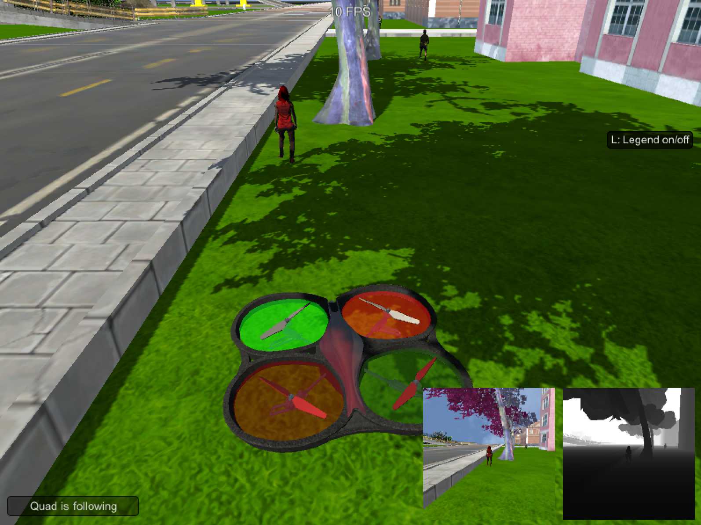

[](https://www.udacity.com/robotics)

## Project 4: Deep Learning  - Follow Me Quadcopter
##### Udacity Robotics Nanodegree
###### Feb 2019


### Overview

*** Objective is to program a Quadcopter to identify and shoot, I mean follow the target. ***

##### Specific Objectives

**1.** Analyze images being streamed from a front-facing camera on the drone
**2.** Classify each pixel using a Fully Convolutional Neural Network (FCN)
**3.** Locate the target (hero) in the pixels
**4.** Follow the target with the Quadcopter

Operate the quadcopter through Quadsim (ran locally).

`model_training.ipynb` is the code for the segmentation network.

I've collected some data of my own on the Quadsim, but due to time constraints, I elected to use the data provided by Udacity.

[Training](https://s3-us-west-1.amazonaws.com/udacity-robotics/Deep+Learning+Data/Lab/train.zip)
[Validation](https://s3-us-west-1.amazonaws.com/udacity-robotics/Deep+Learning+Data/Lab/validation.zip)
[Evaluation](https://s3-us-west-1.amazonaws.com/udacity-robotics/Deep+Learning+Data/Project/sample_evaluation_data.zip)

#### Model Building
Lesson 33.4 shows how to build a Fully Convolutional Neural Network (FCN) in processing images and will follow this example and see how it goes.

Encoding --> Decoding  --> Assign each pixel to one of the classes.

#### Architecture
I will be sticking with the lecture and start with the symmetrical 5 layer model architecture.  
The structure will be Input-->64-->126-->256-->126-->64-->Output

#### Input
The original image is of size 256x256x3 and resized to 160x160x3 with `data_iterator.py`.  Giving us an input layer size of 160,160,3.  Using a 1x1 convolutional layer in the middle of the network allows us to take any sized image.  A fully connected layer would require a specifi set of input dimensions.

#### Encoder
The Encoder's job is to get the important features in the image, keep them in memory, remove noise of other pixels, decrease width and height while increasing layer depth.

First two layers are the encoder and responsible in getting the features to extract from the input image.  The first layer is set to have the strides=2 and number of filters to be 64.

The formula in determining height/width of the next layers: (N-F + 2*P)/S + 1.

layer1_height_width = (160-3 + 2*1)/2 + 1, so layer1 = 80x80x64 since we chose 64 filters of 3x3 filter dimension.

For the second layer: 2^7=128 filters of size 3x3.

The encoder block harnesses the separable_conv2d_batchnor() which defaults to a kernize size of 3x and same padding.  This will generate an output of K filter layers deep, with width and height of (n-F + 2*p)/S + 1.

```
def encoder_block(input_layer, filters, strides):
    output_layer = separable_conv2d_batchnorm(input_layer, filters, strides)
    return output_layer
```

The start of our model looks like this:
```
def fcn_model(inputs, num_classes):

    # ENCODER
    layer1 = encoder_block(inputs, 64, 2)
    layer2 = encoder_block(layer1, 128, 2)
```

Middle layer

Between the Encoder and the Decoder is the 1x1 **convolutional layer** for the task of semantic segmentation.  This will allow us to assign individual pixels to one of the three classes.  Using the 1x1 convolutional layer allows us the following:
1. The network is more flexible by allowing different sized input image, instead of being fixed to one size.
2. It decreases dimensions, while preserving spatial information of the image, which allows us to output a segmented image.
3. It adds depth to our model and increase parameters at a fairly low computational price.

*The 1x1 convolution*


I used 256 filters for the middle as not to compromise spatial data from our image.

The next portion of our fcn_model function is:
```
def fcn_model(inputs, num_classes):
    # See encoder portion from above!

    # 1x1 Convolution layer using conv2d_batchnorm()
    layer3 = conv2d_batchnorm(layer2, 256, kernel_size=1, strides=1)
```

##### Decoder

Upsampling is crucial in the second half of our FCN in order to transform the important features we learned from encoding into the final segmented image in the output. **Bilinear Upsampling** helps transform our downsampled image back into the resolution of our original input image.

Here's a good dipiction of how different types of **upsampling** works:

IMAGE goes here!!!

**Bilinear Upsampling** will be used repeatedly for the Decoder Layer.
```
def bilinear_upsample(input_layer):
    output_layer = BilinearUpSampling2D((2,2))(input_layer)
    return output_layer
```

I'll also use `layers.concatenate`, which will help us implement skip connection, as well as `separable_conv2d_batchnorm` function. These functions will make up our `decoder_block` function:
```
def decoder_block(small_ip_layer, large_ip_layer, filters):

    # Upsample the small input layer using the bilinear_upsample() function.
    upsample = bilinear_upsample(small_ip_layer)

    # Concatenate the upsampled and large input layers using layers.concatenate
    concat_layer = layers.concatenate([upsample, large_ip_layer])

    # Add separable convolution layers
    temp_layer = separable_conv2d_batchnorm(concat_layer, filters)
    output_layer = separable_conv2d_batchnorm(temp_layer, filters)

    return output_layer
```

The choice for the **decoder** was simple, in that I simply scaled back up from the middle **1x1** convolutional layer to the final output image size. In this moment, the term deconvolution feels fitting, as it is what I had in mind while building the decoder(however, I know it is a contentious term).

The next portion of the `fcn_model` function is:
```
def fcn_model(inputs, num_classes):
    # See Encoder and 1x1 convolutional sections from above!

    # DECODER
    layer4 = decoder_block(layer3, layer1, 128)
    layer5 = decoder_block(layer4, inputs, 64)
```

###### Output

We finally apply our favorite activation function, **Softmax**, to generate the probability predictions for each of the pixels.
```
return layers.Conv2D(num_classes, 1, activation='softmax', padding='same')(layer5)
```
This completes our `fcn_model` function to be...
```
def fcn_model(inputs, num_classes):
    layer1 = encoder_block(inputs, 64, 2)
    layer2 = encoder_block(layer1, 128, 2)
    layer3 = conv2d_batchnorm(layer2, 256, kernel_size=1, strides=1)
    layer4 = decoder_block(layer3, layer1, 128)
    layer5 = decoder_block(layer4, inputs, 64)
    return layers.Conv2D(num_classes, 1, activation='softmax', padding='same')(layer5)
```

This final layer will be the same height and width of the input image, and will be `c-classes` deep. In our example, we have 3 classes deep because we are aiming to segment our pixels into one of the three classes!

##### Training

###### Hyperparameters

**learning_rate**: The learning rate(aka `alpha`) is what we multiply with the derivative of the loss function, and subtract it from its respective weight. It is what fraction of the weights will be adjusted between runs.  The `learning_rate` was reasonably straight forward to set. I set the learning rate to be `0.001` which seems reasonable and looks like this might be the "standard".

**batch_size**: The batch size is the number of training examples to include in a single iteration.

**num_epochs**: An epoch is a single pass through all of the training data. The number of epochs sets how many times you would like the network to see each individual image.

**steps_per_epoch**: This is the number of batches we should go through in one epoch. In order to utilize the full training set, it is wise to make sure `batch_size*steps_per_epoch = number of training examples` In our case, this is `64*75=4800`, so a few images are seen more than once by the network(we have 4132 images in the training data provided).

**validation_steps**: Similar to steps per epoch, this value is for the validation set. The number of batches to go through in one epoch.

**workers**: This is the number of processes we can start on the CPU/GPU.

##### Evaluation

| Learning Rate | Batch Size | Num Epochs | Steps per Epoch | Validation Steps | Workers |  Final Score |Result Page|Success|
|---|---|---|---|---|---|---|---|--|
|.001|64|60|75|50|120|**0.404**|[Result Page](./model_training_001_64_60_75_50_120.html)|Yes|
|.001|64|30|75|50|120|**0.394**|[Result Page](model_training_001_64_30_75_50_120.html)|No|
|.001|64|45|65|50|120|**.413**|[Result Page](model_training_001_64_45_75_50_120.html)|Yes|
|   |   |   |   |   |   |   |   ||  |


### Future Enhancements

This project is a good excuse to buy a very expensive video card, something like a 1080 Ti NVidia Card :-)
